# Time Series Air Quality Project
I compared the air quality data of my beautiful hometown Kunming and home away from home New York City, as part of a small data engineering project.

I ingest csv files containing historical air quality data into InfluxDB, then connect to Grafana for visualization. Additionally, I call Weather API to ingest live air quality data for these two cities into the database and dashboard. 

I focus on time series data in this project, but it can also be used IoT data, sensor data, measuring processes, etc.

# Build the Pipelines
## Database Selection
InfluxDB was chosen for this project because it specializes in time series data. It is also NoSQL, which was good for this project because air quality data from different sources tended to contain additional fields that varied from station to station. Even for a given weather station, fields were observed to change over time.

For example, sample data for both cities show that NYC doesn't have pm10 data, and had pm25 data in 2014, but seems to no longer provide that information in 2020:

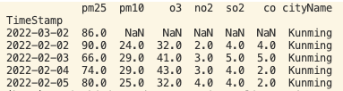 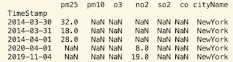

## Environment Setup
### InfluxDB and Grafana Setup
- Create folders(*data*, *config*, *gfdata*) as listed under volumes in the [docker-compose.yml](docker-compose.yml) file
- Run `docker compose up`
- Go to `localhost:8086` and sign in on Influxdb, use the username and password you assign in the *docker-compose.yml* file, you should see your bucket has been setup, create a token if it's not automatically generated already
- Go to `localhost:3000` and sign in on Grafana, use the username and password you assign in the *docker-compose.yml* file, it should ask you to reset your password
- Install the InfluxDB python client library: `pip install influxdb-client`

## Ingest Historical Data to InfluxDB
- Historical air quality data for Kunming City and New York City was obtained from this <a href="https://aqicn.org/data-platform/register/" target="_blank">website</a>
- Use a small dataset to test first, if the [code](./code/ingest_historical.py) runs successfully, you should see your test data in the bucket, like this:
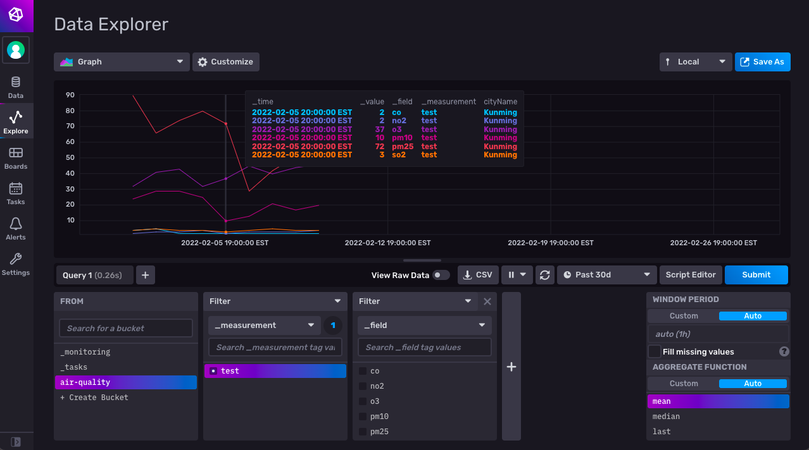
- Ingest the historical air quality data for Kunming from 2014-01-01 to current, it will look like this:
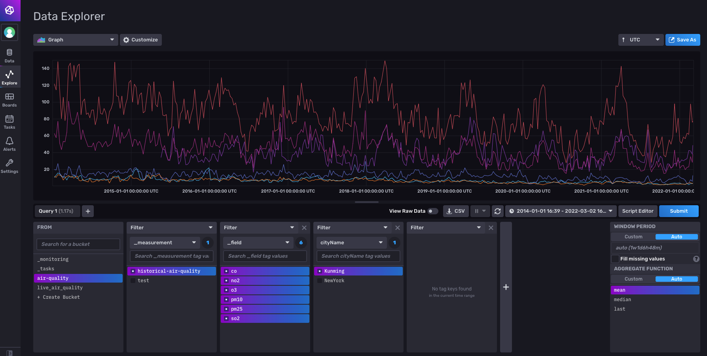
- Bring in New York City air quality data to compare 
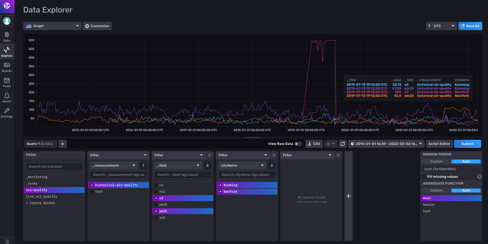
- Here is an example [code](./code/query.py) if you want to query data from InfluxDB and do further analysis 

## Connect InfluxDB to Grafana for Visualization
- Setup your Grafana to connect to InfluxDB
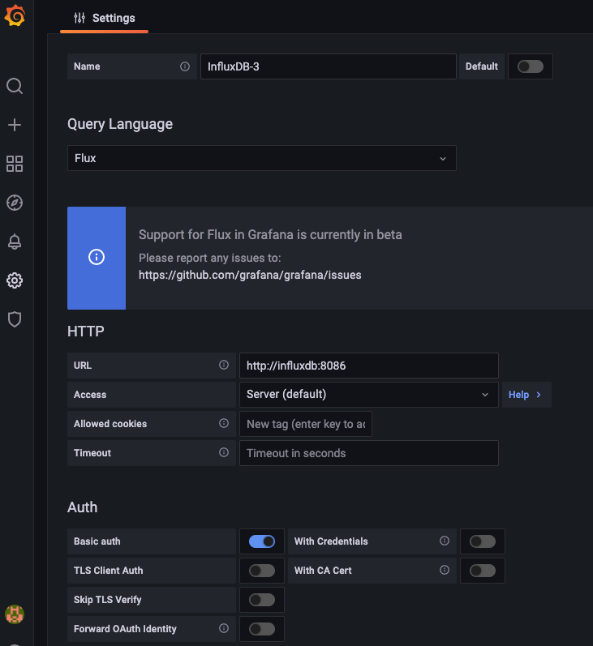
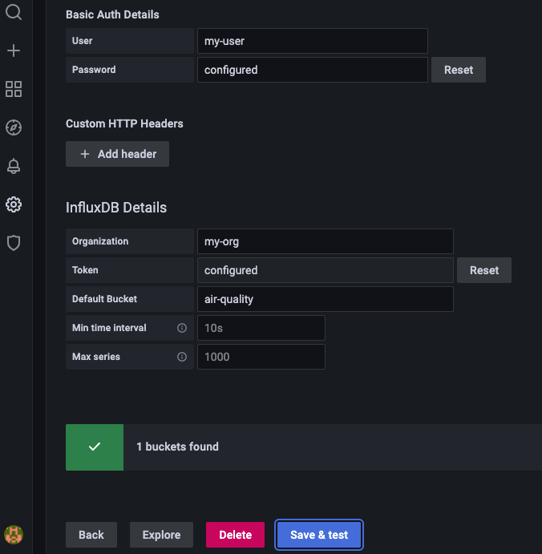
- Create a new token in InfluxDB for Grafana to connect to the specific bucket with only __read__ permission
- In InfluxDB, click *Script Editor*, copy the InfluxDB query 
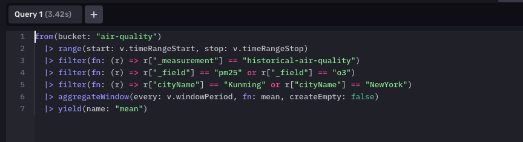
- In Grafana, create a new dashboard and a new panel and paste the query in the empty field, don't forget to set the __customer time range__. The visualization of your time series data should appear 
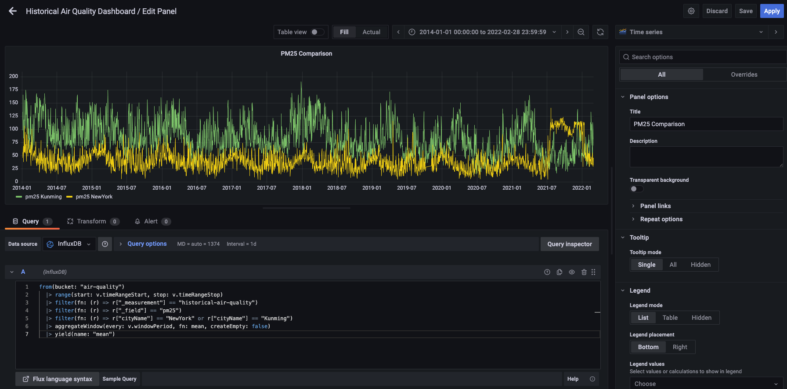
- Have fun and save your dashboard
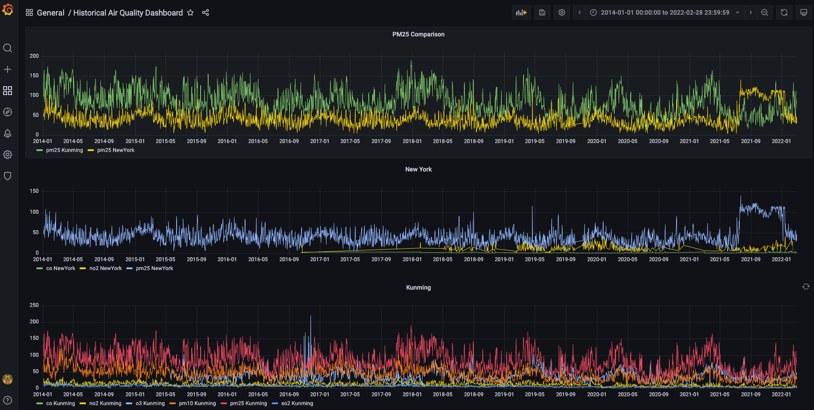

## Ingest Live Data to InfluxDB
- Register for free at <a href="https://www.weatherapi.com/" target="_blank">weather api</a>, save your token
- Create a new bucket in InfluxDB for the live data
- Run [code](./code/ingest_live.py) to get data from the api and write data to the new bucket in InfluxDB
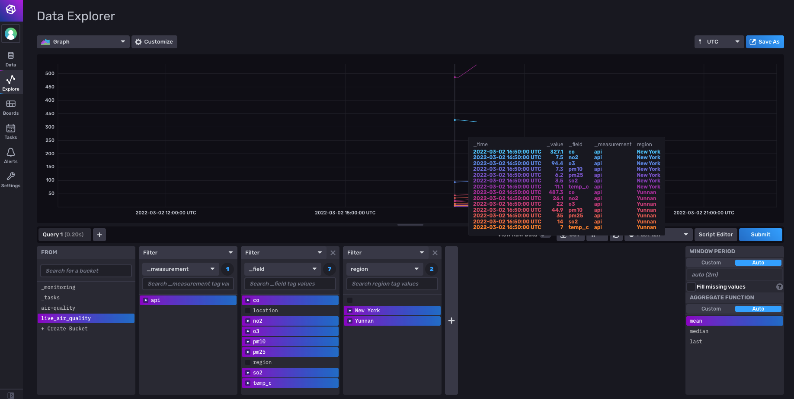
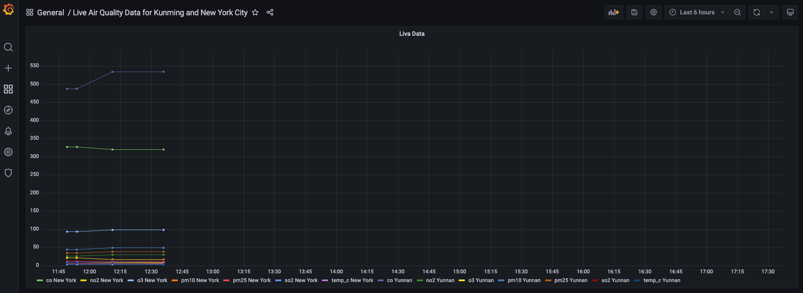

## Potential Future Steps
- Explore serverless options for database, i.e. InfluxDB Cloud
- Host project remotely and schedule ingest_live.py

***

If you have any comments or questions, feel free to reach out at anqiproject234@gmail.com 

